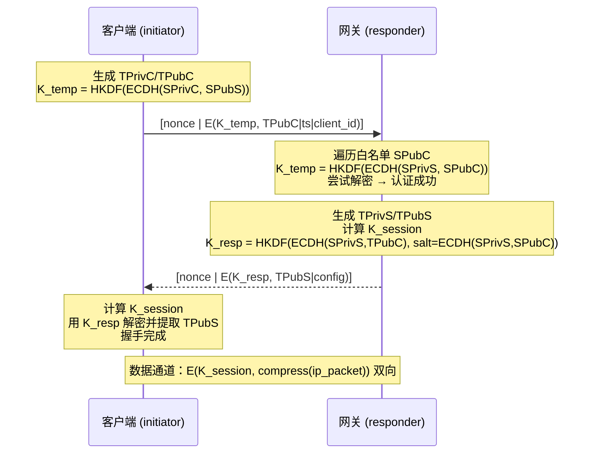

# aVPN 设计文档

> aVPN 是一个基于 C++20 协程（boost::asio awaitable）的端到端加密 VPN 实现。
> 本文档描述系统的整体设计、协议细节与模块实现。

---

## 1. 概述

aVPN 设计基于点对点通信，本身不区分 server/client，而是通过配置将一端作为 **gateway**（网关，即传统意义上的 server），另一端作为 **endpoint / client**（端点）。通信双方预先配置对方的静态公钥，通过 **1-RTT 完全加密握手** 协商出对称会话密钥，之后所有流量均通过该密钥加密传输。

**核心设计目标：**

- 整个握手过程（Message 1 / Message 2）在网络传输时**完全加密**，不包含任何明文的协议头、ID 或可识别的指纹。
- 数据通道使用 AEAD 对称加密（ChaCha20-Poly1305），无任何明文协议。
- 支持 UDP + FEC 纠删码与 TCP 两种传输，适配不同网络环境。
- 支持压缩（握手时协商，先压缩后加密）。

### 配置示例

| 角色 | 示例地址 | 说明 |
|---|---|---|
| gateway | `10.0.0.1` | 拥有静态密钥对 `(SPrivS, SPubS)`，配置客户端静态公钥白名单 `pkl_` |
| endpoint | `10.0.0.2` | 拥有静态密钥对 `(SPrivC, SPubC)`，配置网关静态公钥 `SPubS` |

---

## 2. 架构与模块划分

```
┌─────────────────────────── avpn_service ───────────────────────────┐
│  gateway/client 模式调度 · 监听 · 会话管理 · DDoS 防护 · vaddr 分配 │
└───────┬──────────────────────────────────────────────┬─────────────┘
        │ create/session 回调                           │
┌───────▼──────────────────────────────────────────────▼─────────────┐
│                         avpn_session                                │
│  握手 · 密钥派生 · 数据通路 · keepalive/断开 · UDP/TCP 传输          │
└───┬──────────┬───────────┬───────────┬───────────┬─────────┬────────┘
    │          │           │           │           │         │
┌───▼───┐ ┌────▼────┐ ┌────▼────┐ ┌────▼────┐ ┌────▼────┐ ┌──▼─────┐
│crypto │ │protocol │ │compress │ │  fec    │ │  tun    │ │ 日志   │
│OpenSSL│ │序列化/  │ │zlib     │ │RS GF(2⁸)│ │Linux/mac│ │xlogger │
│X25519 │ │endpoint │ │deflate  │ │编码/重建│ │OS utun  │ │        │
│AEAD   │ │解析     │ │         │ │         │ │         │ │        │
│HKDF   │ │         │ │         │ │         │ │         │ │        │
└───────┘ └─────────┘ └─────────┘ └─────────┘ └─────────┘ └─────────┘
```

| 模块 | 文件 | 职责 |
|---|---|---|
| `avpn_service` | `avpn.cpp` / `avpn.hpp` | 服务调度、监听、会话管理、DDoS 防护、虚拟地址分配 |
| `avpn_session` | `avpn_session.cpp/.hpp` | 单会话：握手、密钥派生、数据通路、保活/断开、UDP/TCP 传输 |
| `avpn_crypto` | `avpn_crypto.cpp/.hpp` | OpenSSL 封装：X25519、ChaCha20-Poly1305、HKDF-SHA256、base64 |
| `avpn_protocol` | `avpn_protocol.cpp/.hpp` | 协议常量、报文结构、序列化、endpoint 解析 |
| `avpn_compress` | `avpn_compress.cpp/.hpp` | 压缩抽象（zlib deflate） |
| `avpn_fec` | `avpn_fec.cpp/.hpp` | Reed-Solomon 纠删码（GF(2⁸)）与分片编解码 |
| `avpn_tun` | `avpn_tun.cpp/.hpp` | tun 设备抽象（Linux `/dev/net/tun`、macOS utun、Windows wintun、fd 透传） |
| 基础设施 | `io_context_pool.hpp` / `logging.hpp` | 线程池与日志（xlogger） |

---

## 3. 密钥体系

### 3.1 密钥材料

| 密钥 | 说明 |
|---|---|
| `(SPriv, SPub)` | 静态长期密钥对（X25519），双方预先交换公钥 |
| `(TPriv, TPub)` | 握手时生成的临时密钥对，每次握手随机 |
| `K_temp` | 临时握手密钥（加密 Message 1） |
| `K_resp` | 响应密钥（加密 Message 2） |
| `K_session` | 会话密钥，派生 `key_c2s` / `key_s2c` 双向密钥 |

### 3.2 密钥派生（HKDF-SHA256）

所有派生均使用 `HKDF-SHA256`，info 字符串约定如下：

```cpp
kdf_temp_info  = "avpn-handshake-temp-v1"
kdf_resp_info  = "avpn-handshake-resp-v1"
kdf_session_master_info = "avpn-session-master-v1"
kdf_c2s_info   = "avpn-session-c2s-v1"
kdf_s2c_info   = "avpn-session-s2c-v1"
```

**Message 1 临时密钥：**

$$K_{temp} = \text{HKDF}(ECDH(SPriv_C, SPub_S),\ \text{salt}=\varnothing,\ \text{"avpn-handshake-temp-v1"},\ 32)$$

网关端遍历白名单中每个 `SPub_C`，计算 `ECDH(SPriv_S, SPub_C)` 得到对应 `K_temp` 尝试解密。

**Message 2 响应密钥：**

由于客户端在收到 `TPubS` 之前无法计算完整的会话密钥，Message 2 使用独立的 `K_resp`：

$$
K_{resp} = \text{HKDF}\big(ECDH(TPriv_C, SPub_S),\ \text{salt}=ECDH(SPriv_C, SPub_S),\ \text{"avpn-handshake-resp-v1"},\ 32\big)
$$

服务端对应：

$$
K_{resp} = \text{HKDF}\big(ECDH(SPriv_S, TPub_C),\ \text{salt}=ECDH(SPriv_S, SPub_C),\ \text{"avpn-handshake-resp-v1"},\ 32\big)
$$

**会话密钥（四次 DH + 排序拼接）：**

$$
\begin{aligned}
dh_{ss} &= ECDH(\text{my static}, \text{peer static}) \\
dh_{se} &= ECDH(\text{my static}, \text{peer eph}) \\
dh_{es} &= ECDH(\text{my eph}, \text{peer static}) \\
dh_{ee} &= ECDH(\text{my eph}, \text{peer eph}) \\
\\
ikm &= \text{sort}(dh_{se},\ dh_{es},\ dh_{ee}) \text{ 拼接} \\
master &= \text{HKDF}(ikm,\ \text{salt}=dh_{ss},\ \text{"avpn-session-master-v1"},\ 32) \\
key_{c2s} &= \text{HKDF}(master,\ \varnothing,\ \text{"avpn-session-c2s-v1"},\ 32) \\
key_{s2c} &= \text{HKDF}(master,\ \varnothing,\ \text{"avpn-session-s2c-v1"},\ 32)
\end{aligned}
$$

> `dh_se/dh_es/dh_ee` 排序后拼接，保证两端在本地视角不同的情况下计算出相同的 `ikm`。
> 客户端用 `key_c2s` 加密、`key_s2c` 解密；服务端相反。AEAD 认证失败直接丢弃，无任何明文反馈。

---

## 4. 握手协议（1-RTT）

### 4.1 线格式

所有握手包均为：

```
[ nonce(12) | ciphertext ]
```

即 12 字节随机 nonce + ChaCha20-Poly1305 密文（含 16 字节 tag）。网络传输中**没有任何明文标识**，网关收到数据报后须用白名单密钥逐一尝试解密（见 `try_decrypt_handshake_msg1`）。

### 4.2 Message 1（C → S）

明文载荷：

```
[ TPubC(32) | timestamp(8, LE 毫秒) | client_id(32) ]
```

| 字段 | 大小 | 说明 |
|---|---|---|
| `TPubC` | 32 | 客户端临时公钥 |
| `timestamp` | 8 | 当前毫秒时间戳，用于防重放 |
| `client_id` | 32 | 客户端随机身份 ID |

用 `K_temp` 加密整个载荷。

### 4.3 Message 2（S → C）

明文载荷：

```
[ TPubS(32) | session_config ... ]
```

`session_config` 为协商的会话配置（见 `session_config` 结构体），包含：

- `compress`：压缩算法（none/deflate/lz4/zstd）
- `data_shards` / `parity_shards`：FEC 参数
- `keepalive`：保活间隔（秒）
- `mtu`：tun MTU
- `vaddr`：网关分配的虚拟地址
- `prefix_length`：子网前缀长度
- `passbyvpn`：是否默认全局出口
- `pushdns`：推送的 DNS
- `routes`：推送的路由列表

用 `K_resp` 加密整个载荷。

### 4.4 握手时序



### 4.5 握手失败与重试

- **initiator**：发送 Message 1 后启动 `m_hs_timer` 重发定时器，最多重发 5 次（`m_hs_retry > 5` 判定握手超时并关闭）。UDP 与 TCP 传输均适用。
- **responder**：收到 Message 1 后通过 DDoS 防护校验，认证成功才回复 Message 2。
- 解密失败或 AEAD 认证失败的数据报直接丢弃，不产生任何响应（避免被用于探测）。

### 4.6 防重放

- **时钟窗口**：Message 1 的 `timestamp` 必须在当前时间 ±30 秒内，超出直接丢弃。
- **单调性检查**：按对端静态公钥记录最近接受的时间戳（`m_msg1_ts`），拒绝时间戳不回退的握手。

---

## 5. 数据通道协议

### 5.1 帧格式

会话建立后，每个数据帧均为：

```
[ nonce(12) | ciphertext ]
```

- **UDP**：每个帧即一个 UDP 数据报正文。
- **TCP**：帧前加 2 字节大端长度前缀，构成 TCP 流式帧。

### 5.2 加密消息类型

数据帧解密后的明文首字节为消息类型（`msg_type`），类型不暴露在网络中：

| 值 | 类型 | 说明 |
|---|---|---|
| `0x01` | `data` | 数据消息（可含 FEC 分片） |
| `0x02` | `keepalive` | 保活消息（携带时间戳，用于 RTT） |
| `0x03` | `keepalive_reply` | 保活回复 |
| `0x04` | `disconnect` | 主动断开 |
| `0x05` | `ack` | 数据确认（预留） |

### 5.3 发送 / 接收流水线

```
发送 (tun → 对端):
  ip_packet ──► 压缩 ──► FEC 分片 ──► type(1)|body ──► AEAD 加密 ──► UDP/TCP 发送

接收 (对端 → tun):
  UDP/TCP ──► AEAD 解密 ──► type 分发 ──► FEC 重组 ──► 解压 ──► 交付 tun
```

> 顺序遵循设计：**先压缩、后加密；先解密、后解压**。压缩在 FEC 之前进行（先压缩减少分片体积）。

---

## 6. FEC 纠删码

### 6.1 Reed-Solomon 编码

- 基于 **GF(2⁸)**，本原多项式 `0x11d`。
- `reedsolomon(data_shards, parity_shards)`：`data` 分片经 Vandermonde 生成矩阵编码为 `parity` 分片。
- **系统形式（systematic form）**：编码矩阵经行变换化为 `[I | P]`，编码时数据分片原样保留，仅附加校验分片，避免编码矩阵重复计算，且便于直接选取未丢失分片重建。
- **重建**：任意选取 `data_shards` 个未丢失的分片，构建子矩阵并求逆（高斯-约当消元），恢复全部数据分片并重算缺失的冗余分片。最多可容忍 `parity_shards` 个分片丢失。

### 6.2 GF(2⁸) 查表与 SIMD 优化

域运算全部基于**编译期生成**的静态表（`constexpr`，无运行时初始化开销）：

| 表 | 说明 |
|---|---|
| `log_table` / `exp_table` | 对数/指数表；指数表长度为 512（双周期），加法免取模 |
| `mul_table` | 256×256 乘法表，单次查表完成 GF 乘法 |
| `low_tables` / `high_tables` | 低/高半字节紧凑表（256×16），供 SIMD 批量查表 |

批量乘法 `out = c × in` / `out ^= c × in` 按平台分派：

- **x86-64**：SSSE3 / AVX2，`pshufb` 并行查表（16/32 字节每次）。
- **aarch64**：NEON，`vqtbl1q` 并行查表。
- **分派策略**：GCC/Clang 使用 per-function `target` attribute + `__builtin_cpu_supports` 运行时检测；MSVC 无 per-function attribute，整个 TU 以 `/arch:AVX2` 编译，用 `__cpuid` 运行时分派，不支持 AVX2/SSSE3 时回退标量查表。

### 6.3 矩阵缓存

- **编码矩阵缓存**：按 `(data_shards, parity_shards)` 全局缓存系统形式编码矩阵，避免每个会话重复生成 Vandermonde 矩阵。
- **逆矩阵 LRU 缓存**：按 `(data_shards, parity_shards, 选中分片位图)` 缓存解码子矩阵的逆（容量 64），避免每次恢复重复高斯-约当消元。

### 6.4 分片帧格式

当 `data_shards > 1` 时，数据消息体为：

```
[ fec_id(4, LE) | total(1) | index(1) | len(2, LE) | shard ]
```

`fec_frame_header_size = 8` 字节。同一 IP 包的所有分片共享 `fec_id`，接收方按 `fec_id` 收集分片，凑齐 `data_shards` 个即可恢复。

### 6.5 冗余拷贝模式

当 `data_shards == 1` 且 `parity_shards > 0` 时，不进行 RS 编码，而是将整个包发送 `parity_shards + 1` 份拷贝（即 1 份原始 + `parity_shards` 份冗余）。

### 6.6 过期清理

`fec_decode_group::purge()` 定期清理超过 3 秒未凑齐的过期分组，防止内存膨胀。

---

## 7. 压缩

- 压缩算法由握手时在 `session_config.compress` 中协商，当前支持 `deflate`（zlib），`lz4`/`zstd` 预留。
- `compressor` 抽象封装 `set_type / compress / decompress`：
  - `compress`：`compress2`（`Z_BEST_SPEED`）。
  - `decompress`：`uncompress`，带最大输出限制（防解压炸弹）。
- 未启用压缩或压缩后未减小体积时，回退为原始数据。

---

## 8. 传输机制

### 8.1 UDP 传输

- 每帧一个 UDP 数据报，正文为 `[nonce | ciphertext]`。
- 支持 FEC 纠删码，适用于丢包率高的网络环境。
- 网关侧共享一个 UDP socket（`udp_send_handler` 由 service 注入），多会话复用。
- **并发接收**：每个 UDP socket 启动 `udp_receive_concurrency` 个并发接收协程
  （`clamp(hardware_concurrency, 2, 16)`，参考 avpn 的 `global_op_concurrency`）。
  单 io_context 单线程调度下，多协程并发异步接收，在数据包处理（解密/FEC）期间
  接收不中断，提升高 PPS 场景下的吞吐。

### 8.2 TCP 传输

- 每帧为 `[len(2, BE) | nonce | ciphertext]` 的 TCP 流式帧。
- 使用 `m_tcp_oqe` 写队列 + `start_tcp_write` 协程泵串行写出，保证帧边界完整。
- 接收端 `tcp_read_loop` 读取长度前缀后按帧分发（握手/数据）。
- 数据面优化（设计目标，当前为后续增强）：
  - IP 包为 TCP 且为 SYN 时，为该 TCP 流创建**专用 TCP socket** 传输，避免 TCP-in-TCP。
  - IP 包为 UDP 时，按目标 Address 建立**独立 TCP socket** 传输。
  - `ip_proto()` / `is_tcp_syn()` 解析函数已实现；当前实现使用单一加密控制流承载全部数据。

---

## 9. 会话生命周期

### 9.1 状态

| 状态 | 说明 |
|---|---|
| `established` | 握手完成，可收发数据 |
| `abort` | 会话已终止（超时/断开/关闭） |

### 9.2 Keepalive 与超时

- 每 `keepalive` 秒发送加密 `keepalive` 消息（携带发送时间戳），对端回复 `keepalive_reply`（回显时间戳）。
- 收到任何有效数据（含 keepalive/reply）均刷新 `m_last_seen`。
- 超时判定：`now - m_last_seen > keepalive × 3` 秒 → 判定对端失联，关闭会话并释放资源。

### 9.3 主动断开

- 一端调用 `disconnect()` 时发送加密 `disconnect` 消息，对端收到后进入 `abort` 状态并释放资源。
- 意外断开由 9.2 的超时机制兜底。

### 9.4 tick 协程

`tick()` 为 1 秒循环协程（`m_tick_timer`），驱动保活发送与超时检测；会话关闭时取消定时器。

### 9.5 网络切换无感知

客户端物理网络变化（如 wifi → 移动网络）会导致本地出口地址/端口变化，avpn 通过
服务端会话迁移与客户端 socket 重建实现无感切换：

- **服务端会话迁移**：网关除 `m_sessions`（endpoint → session）外，另维护
  `m_sessions_by_pubkey`（对端静态公钥 → session）。收到未知 endpoint 的 UDP 数据报时，
  遍历已建立会话用各自接收密钥尝试 AEAD 解密（`try_decrypt_udp`），命中即认为是对端
  网络切换后的数据，更新会话对端 endpoint（`update_remote_udp`）并迁移 `m_sessions`
  索引，数据流不中断、无需重新握手。
- **客户端监控与重建**：`client_network_monitor` 每 2 秒探测到服务器的本地出口源地址
  （`local_source_address`，临时 socket connect 做路由探测），发现变化后调用
  `renew_client_udp`：关闭旧 socket、新建 UDP socket（尽量复用旧本地端口）、重新启动
  接收循环，并立即发送一次 keepalive 使服务端尽快迁移。
- 会话密钥与 vaddr 均不依赖 IP，迁移后保持原有 vaddr，tun 配置无需变更。
- 客户端重启（同公钥新握手）时，网关关闭同公钥旧会话并替换（`Replacing old session`）。

### 9.6 带宽统计

- 会话在 `send_plaintext` / `process_plaintext` 中累计明文上下行字节
  （`m_upload_bytes` / `m_download_bytes`，含 FEC 帧开销）。
- `tick()` 每秒对累计值做 3 采样槽滑窗采样（`update_speed`），以窗口首尾差值计算
  瞬时速率（`upload_rate` / `download_rate`）。
- 服务端与客户端均启动 `bandwidth_report_loop`，每 10 秒输出各会话/隧道的
  `up=` / `down=` 速率与 `total_up=` / `total_down=` 累计值。

---

## 10. DDoS 缓解

为避免引入 2-RTT Cookie，网关侧通过 `avpn_service::ddos_guard` 实现：

| 机制 | 参数（默认） | 说明 |
|---|---|---|
| 每 IP 握手限速 | 5 秒 | 单个源 IP 每 5 秒最多接受一次握手尝试 |
| 失败次数限制 | 5 次 | 连续 5 次握手失败进入封锁 |
| 封锁时长 | 60 秒 | 封锁期内直接丢弃该 IP 的握手包 |

流程：`on_gateway_udp_packet` → `ddos_guard->allow_handshake(ip)` 校验 → 尝试握手 → `report_success` / `report_failure` 更新状态。被封锁或超限的 IP 在封锁期/限速窗口内不做任何响应。

---

## 11. tun 设备

`tun_device` 提供三种打开方式：

1. `ptun_fd_ >= 0`：直接使用外部传入的 tun fd（如通过 SCM_RIGHTS 传递）。
2. `utun_fd_ >= 0`：通过 Unix Domain Datagram Socket 以 IPC 方式读写 IP 数据包。
3. 平台默认打开：
   - **Linux**：`/dev/net/tun` + `TUNSETIFF`，通过 `SIOCSIFADDR`/`SIOCSIFNETMASK`/`SIOCSIFMTU`/`SIOCSIFFLAGS` 配置地址、掩码、MTU 与 UP。
   - **macOS**：`utun` 接口（`<net/if_utun.h>` + `SYSPROTO_CONTROL`），配置使用 `ifconfig`。
   - **Windows**：wintun 驱动（见 `avpn_wintun` 模块）。

异步读写封装在 `net::posix::stream_descriptor`（`async_read_some` / `async_write_some`），与 asio 协程无缝集成。

### 11.1 Windows wintun

Windows 平台由 `avpn_wintun`（`avpn_wintun.cpp/.hpp`）实现 tun 后端，`tun_device`
在 `_WIN32` 下将成员替换为 `wintun_tun_device` 并转发全部操作：

- **驱动集成**：wintun 驱动（`wintun.sys/inf/cat`）以资源方式内嵌 exe，首次运行
  自动解压并经 `pnputil` 安装；适配器管理动态加载 `wintun.dll`。
- **环形缓冲**：应用自建 send/receive 两个 ring（`CreateFileMapping` +
  `MapViewOfFile`）与两个 auto-reset 事件，通过 `TUN_IOCTL_REGISTER_RINGS`
  注册给驱动。ring 为无锁 SPSC 队列，`head`（消费者）/`tail`（生产者）按
  8 MiB 容量取模，带 64 KiB 尾部冗余避免跨环拆分；驱动侧
  `WriteULongRelease`/`ReadULongAcquire`，用户态 volatile 读写保证顺序。
  注意 `TUN_REGISTER_RINGS` 的 `send`/`receive` 字段是**驱动视角**命名。
- **异步读写**：读采用"同步首读 → 约 100us spin → `object_handle.async_wait`
  等待事件"三级策略，突发多包时连续调用天然排空 ring；写遇 ring 满则以
  `steady_timer` 定时重试。
- **网络配置**：`CreateUnicastIpAddressEntry` 设置 IPv4/IPv6 地址，
  `SetIpInterfaceEntry` 设置 MTU。

详细原理与实现见 `doc/avpn_wintun.md`。

---

## 12. 服务架构

### 12.1 运行模式

`avpn_service::start()` 根据配置自动选择模式：

- **客户端模式**：配置了 `nexthop_`（支持 `udp://` 或 `tcp://` 前缀）。
  - 打开 tun，创建 initiator 会话（配置对端 `public_key_`）。
  - UDP：创建 socket + `run_initiator_udp(server_ep)` + `client_udp_receive_loop`。
  - TCP：`client_tcp_connect` 连接对端 + `run_initiator_tcp`。
  - `route_tun_packet`：从 tun 读到的 IP 包一律交给 `m_tunnel` 加密发送。
  - 握手完成后 `wait_handshake_and_setup_tun` 按协商的 vaddr/prefix/mtu 配置 tun。

- **网关模式**：配置了 `tcp_listens_` / `udp_listens_`。
  - 打开 tun（配置为子网地址）。
  - UDP/TCP 监听 + `udp_receive_loop` / `tcp_accept_loop`。
  - 每个新对端创建 responder 会话，握手成功后注册进 `m_sessions`（按对端 endpoint 字符串索引），
    同时按对端静态公钥注册进 `m_sessions_by_pubkey`（网络切换识别用）。
  - `route_tun_packet`：解析目标 IP（v4 第 16-19 字节），按目标地址查找会话转发（支持客户端互通）。
  - 会话关闭回调：从 `m_sessions` 移除并释放 vaddr。

### 12.2 虚拟地址分配

- 网关从 `subnet_` 解析子网（如 `10.8.0.0/16`），维护 `m_allocated_addrs` / `m_next_vaddr`。
- `alloc_vaddr()` 分配下一个可用地址，握手成功后通过 `session_config.vaddr` 下发给客户端。

---

## 13. 配置项（service_config）

| 字段 | 说明 |
|---|---|
| `ifdev_` | tun 设备名称（Linux/macOS 接口名；Windows 为 `wintun`） |
| `ptun_fd_` / `utun_fd_` | 外部 tun fd / IPC fd（-1 表示不使用） |
| `controller_` | 控制服务地址（如 `ws://ip:port`），用于动态下发配置 |
| `nexthop_` | 目标 VPN 服务器（客户端模式），支持 `udp://` / `tcp://` |
| `tcp_listens_` / `udp_listens_` | 监听地址（网关模式） |
| `private_key_` / `public_key_` | 本端静态密钥对（base64） |
| `pkl_` | 远端公钥白名单（base64 列表） |
| `mtu_size_` | tun MTU |
| `keepalive_` | 保活间隔（秒） |
| `pushroutes_` / `pushdns_` | 网关推送的路由 / DNS |
| `passbyvpn_` | 是否默认全局出口（网关需配置 NAT） |
| `ignore_push_` | 是否忽略推送的 route/dns |
| `c2c_` | 是否允许客户端间通信 |
| `subnet_` | VPN 子网（如 `10.0.0.0/16`） |
| `data_shards_` / `parity_shards_` | FEC 参数（`data_shards_==1` 时 `parity_shards_` 为发包倍数） |
| `compress_` | 压缩算法（`deflate`/`lz4`/`zstd`，空为不压缩） |

---

## 14. 安全与健壮性

- 握手包无任何明文指纹，网关仅通过 AEAD 认证 + 白名单遍历识别对端，无法从线路上区分握手与数据包。
- 所有控制消息（keepalive/disconnect）均使用会话密钥加密。
- AEAD 认证失败一律静默丢弃，不产生可观测差异。
- Message 1 防重放（时钟窗口 + 单调时间戳），DDoS 防护（限速 + 失败封锁）无需 2-RTT。
- 解压设置最大输出限制，防止解压炸弹。

---

## 15. 已知限制与后续工作

1. **TCP 按流拆分**：`ip_proto()` / `is_tcp_syn()` 已实现，但 TCP 按 SYN 流建立专用连接、按 Address 建立独立 UDP 传输连接的优化尚未接线，当前 TCP 使用单一加密控制流。
2. **客户端路由应用**：`pushroutes_` / `pushdns_` 已协商并存储在 `session_config`，尚未写入操作系统路由表。
3. **压缩算法**：仅 `deflate` 已实现，`lz4`/`zstd` 为预留接口。
4. **多线程**：`io_context_pool` 已提供，当前服务逻辑运行在主 context，可扩展至多 context 提升吞吐。
5. **wintun 单读者**：ring 的 `head` 推进无锁，需保证单个 io_context 上串行调用
   `async_read_some`（当前 `tun_read_loop` 单协程满足）；多协程并发读取会对
   `head` 竞争。
